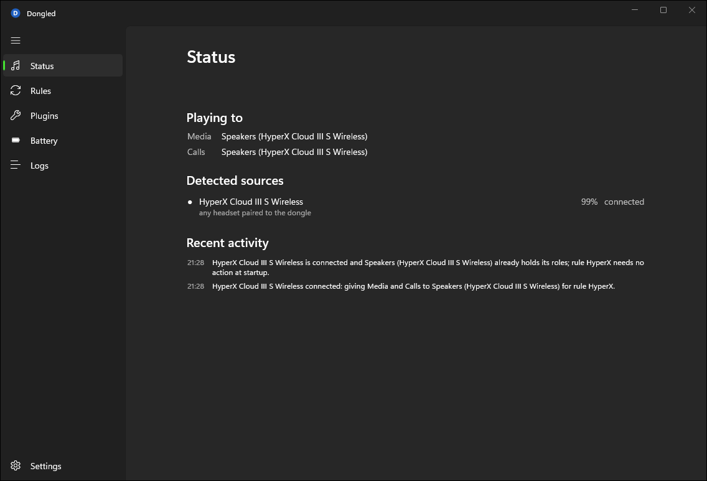
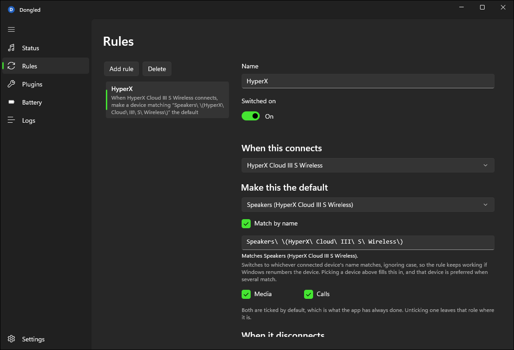
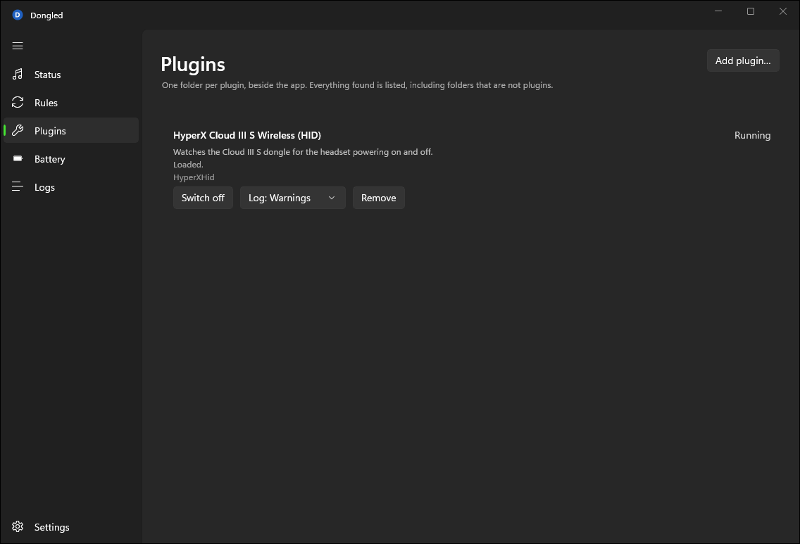
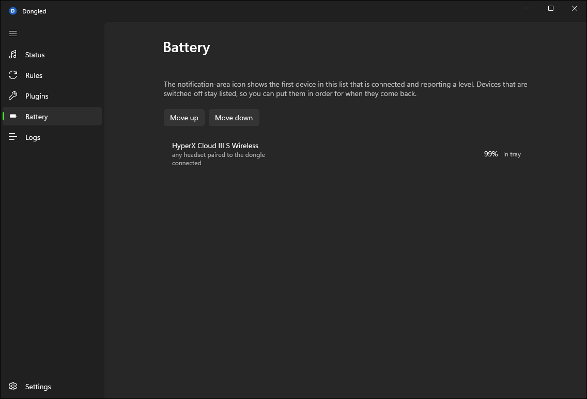

# Dongled

A Windows tray utility that switches your default audio device when a headset turns on, and
switches it back when the headset turns off.

Windows will happily make your wireless headset the default output the moment its dongle
enumerates — and then leave it there after you take the headset off, so the next video plays
to a headset sitting on your desk. It will not switch *back* to your speakers, because as far
as Windows is concerned nothing was unplugged. Dongled watches the headset itself
rather than the audio endpoint, so it knows the difference between "powered on" and "plugged
in", and it puts the default back where it found it.

[](https://github.com/navrozashvili/Dongled/actions/workflows/ci.yml)
[](https://github.com/navrozashvili/Dongled/releases/latest)
[](LICENSE.txt)



## Quick start

1. Download `Dongled-<version>-win-x64.zip` from the
   [latest release](https://github.com/navrozashvili/Dongled/releases/latest), unzip it into a
   folder you can write to, and run `Dongled.exe`.
2. Open **Rules**, click **Add rule**, pick your headset, and pick the device it should become.
3. Turn the headset on and off. That's it — Dongled lives in the tray from here.

## What it does

- **Switches on connect.** When a source you have a rule for becomes present, its target device
  becomes the default — for playback, for communications, or both, per rule.
- **Switches back on disconnect**, four ways: return to whatever was default before, return to
  a specific device, return to the previous device and fall back to a specific one if it is
  gone, or do nothing.
- **Waits before switching back.** A configurable stabilization delay, so a headset that drops
  out for a moment does not bounce your audio around.
- **Reconciles at startup**, so a headset already powered on when you log in is honoured.
- **Shows battery level** in the tray icon and on its own page, for sources whose plugin
  reports one.
- **Tells you what it is doing.** A live status page with current defaults, per-source presence,
  and recent activity in plain sentences — plus an in-app log viewer.
- **Starts with Windows**, per user, optionally straight to the tray.

Everything device-specific lives in a plugin, so support for new hardware does not require
touching the app.

## Supported hardware

Hardware support comes entirely from plugins. Two ship with the app:

| Plugin | Detects | How |
|---|---|---|
| `HyperXHid` | HyperX Cloud III S Wireless | Reads the dongle's USB HID reports directly. No vendor software required. Reports battery and charging state. |
| `Logitech` | Logitech devices visible to G HUB | Connects to G HUB's local agent on `ws://localhost:9010/`. Requires G HUB to be running. |

Two further plugins from an earlier version of the app — Corsair iCUE and HyperX NGENUITY —
**have not been ported** and do not ship. Their source is archived under [`legacy/`](legacy/plugins/README.md)
for whoever wants to port them; neither was portable without the hardware to test against.

If your device is not listed, [writing a plugin](tools/Dongled.Plugin.Sample/README.md)
is the intended path. A plugin needs to answer one question — is this thing present? — and may
optionally report a battery level.

## Requirements

- Windows 10 version 1809 (build 17763) or later, x64.
- Nothing else for the standard download, which is self-contained: no .NET runtime and no
  Windows App SDK runtime to install separately. The smaller framework-dependent download needs
  the [.NET 10 Desktop Runtime (x64)](https://dotnet.microsoft.com/download/dotnet/10.0); it
  still carries its own Windows App SDK.

## Installing

Download the latest release from
[Releases](https://github.com/navrozashvili/Dongled/releases/latest). Every push to `master`
that passes CI is published as a release, versioned `major.minor.build`. Each has two zips with
the same app and the same plugins:

| File | Needs |
|---|---|
| `Dongled-<version>-win-x64.zip` | Nothing. Pick this one if unsure. |
| `Dongled-<version>-win-x64-framework-dependent.zip` | The .NET 10 Desktop Runtime (x64). |

Releases are **unsigned**, because no code-signing certificate exists for this project.
SmartScreen will warn on first run and Windows will not be able to show you a publisher. Check
your download against the release's `SHA256SUMS` instead, for example with
`(Get-FileHash .\Dongled-<version>-win-x64.zip).Hash` in PowerShell.

The app is unpackaged: unzip it into a folder you can write to (the zip has no top-level folder)
and run `Dongled.exe`. To remove it, turn off *Start with Windows* in Settings, then delete the
folder and `%APPDATA%\Dongled\`.

Each bundled plugin has its own version, listed in the release notes, which changes only when the
plugin does. `build/release.ps1` builds the same zips locally.

## Using it

1. Start the app. It lands on **Status**, which shows your current default devices and every
   source the enabled plugins can see.
2. The plugins that ship in a release are already on: **Plugins** marks them *Trusted: shipped
   with Dongled*, and you can switch off any you do not need. A plugin you add yourself, or a
   bundled one whose files have changed, loads only once you approve it there — see
   [Security](#security). Approving records a hash and takes effect on the next start. (A build
   from source ships no such list, so there every plugin needs approving.)
3. Go to **Rules** and add one. The editor reads as a sentence:

   > When **HyperX Cloud III S Wireless** connects, make **Headset (HyperX Cloud III S)** the
   > default for ☑ Media ☑ Calls.
   > When it disconnects, **go back to whatever was default before**, or **Speakers (Realtek)**
   > if that's gone, after waiting **5** seconds.

Edits save as you make them. There is no Apply button and no "Saved." dialog.



<table>
  <tr>
    <td></td>
    <td></td>
  </tr>
  <tr>
    <td align="center">Plugins</td>
    <td align="center">Battery</td>
  </tr>
</table>

### Where your settings live

All per-user, under `%APPDATA%\Dongled\`: `config.json` (settings, rules, plugin
approvals), `state.json` (captured previous defaults), `window.json` (window placement), and
`logs\`. Plugins live in `Plugins\` beside the executable.

Set `DONGLED_DATA_DIR` to point every writable path somewhere else — useful for
running a development build without touching your real configuration. The Settings page says
on screen when it is redirected.

## Security

**A plugin runs in your own process with your full privileges.** Plugins are deny-by-default:
one you have not approved never loads, and approval pins a SHA-256 hash over every file in the
plugin's directory, so any change re-blocks it until you look again. That is integrity, not
containment — it tells you the bytes are the ones you consented to run, not that they are safe.
Install plugins you trust.

The one exception is the plugins a release ships. Their directory names and hashes are compiled
into the app, so a bundled plugin whose files are exactly the shipped ones loads without asking,
trusted as much as `Dongled.exe` itself. Change one file in it and it needs approval like any
other plugin; switch it off and it stays off.

The app never requires administrator, writes nothing machine-wide, and collects no telemetry. Its
only connection off your machine is one request to `api.github.com` to check for a newer release,
made only when you open the window, at most every few hours, never by a build from source, and
never if you turn it off in Settings. It downloads an update only when you click Update, checks
the download against the release's `SHA256SUMS`, and then replaces itself and restarts.

[**SECURITY.md**](SECURITY.md) states the full threat model, including the parts that are *not*
defended and why. Please read it before approving anything, and report vulnerabilities through
[GitHub Security Advisories](https://github.com/navrozashvili/Dongled/security/advisories/new)
rather than a public issue.

## Building

Requires the [.NET 10 SDK](https://dotnet.microsoft.com/download) on Windows.

```
git clone https://github.com/navrozashvili/Dongled.git
cd Dongled
dotnet build Dongled.slnx -c Release
dotnet test Dongled.slnx -c Release
```

The app builds to
`src/Dongled.App/bin/Release/net10.0-windows10.0.19041.0/win-x64/`.

A few things worth knowing before you send a patch:

- Warnings are errors, analyzers run at `latest-all`, and CI runs
  `dotnet format --verify-no-changes`. Run it locally first.
- Package versions are pinned centrally and `packages.lock.json` is committed, so CI restores
  with `--locked-mode`. Adding a dependency means committing the updated lock files.
- `tools/InspectAssembly`, `tools/Dongled.ReleaseTool` and `legacy/` are deliberately outside
  the solution and are not built by a solution build.
- `build/release.ps1` produces the same zips, `SHA256SUMS` and `plugins.json` a release does.
  Changing a bundled plugin's files means bumping its `<Version>`; the release job fails otherwise.

## How it is put together

```
src/Dongled.Abstractions      The plugin SDK. A plugin references this and nothing else.
src/Dongled.Core              Audio endpoints, config, plugin host, switching engine.
src/Dongled.App               WinUI 3 shell, six pages, tray icon.
plugins/                      The two bundled plugins.
tools/Dongled.Plugin.Sample   Minimal worked example; the loader tests point at it.
legacy/                       Unported plugin source from an earlier version. Does not build.
tools/Dongled.ReleaseTool     Plugin hashing and zipping for releases; used by build/release.ps1.
build/                        Release scripts.
docs/decisions/               Architecture decision records.
```

Core knows nothing about the UI, and the switching engine runs on `TimeProvider`, so its
timing behaviour is tested without waiting. Plugins are loaded into collectible
`AssemblyLoadContext`s and reference only the SDK, never the host.

The archived source under `legacy/` predates the project's current name and still says
*AudioSourceSwitcher*; see
[`docs/decisions/0004-the-tool-is-called-dongled.md`](docs/decisions/0004-the-tool-is-called-dongled.md).

## Known limitations

- **Windows only, and not portable.** It depends on WASAPI, the undocumented `IPolicyConfig`
  COM interface, `HKCU\...\Run`, and HID.
- **Setting the default audio device has no public API.** `IPolicyConfig` is undocumented, so
  a Windows update could break switching.
- **Playback devices only.** No microphone or other capture-device switching.
- **Installed plugins load at startup**, so approving or installing one needs a restart. The UI
  says so rather than pretending otherwise.
- **x64 only.** No ARM64 build.
- No profiles, no hotkeys, no per-rule timing, no pause-switching.

## Licence

[Mozilla Public License 2.0](LICENSE.txt).

## Trademarks

HyperX, NGENUITY, Logitech, G HUB, Corsair and iCUE are trademarks of their respective owners.
This project is an independent, unofficial work and is not affiliated with, endorsed by, or
sponsored by any of them. Vendor names are used only to identify the hardware and software each
plugin talks to.
